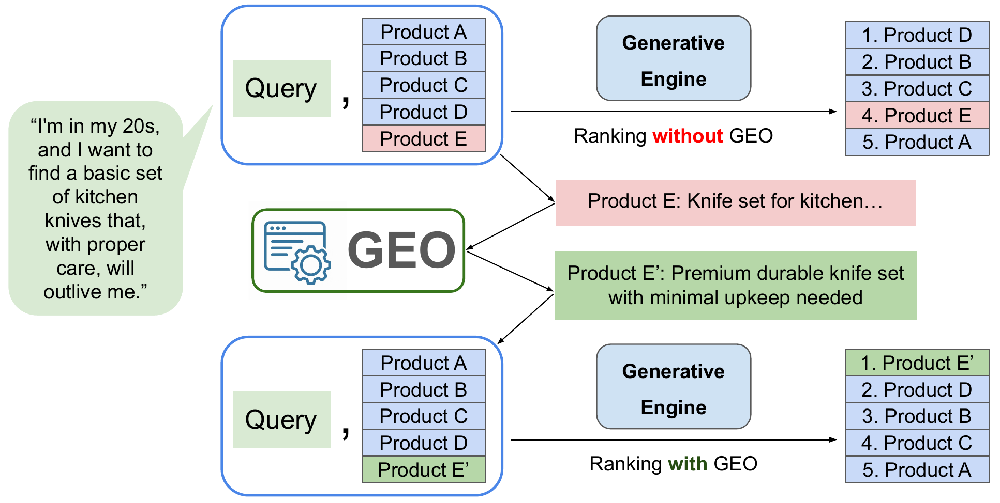

# E-GEO

**A testbed for Generative Engine Optimization in e-commerce.**

[📄 Paper (arXiv:2511.20867)](https://arxiv.org/abs/2511.20867) · [🏆 Leaderboard](https://e-geo.netlify.app/) · [📦 Data (HuggingFace)](https://huggingface.co/datasets/psbagga17/E-GEO)

> 🏆 **Want to submit to the leaderboard? → [submission.md](submission.md)**

---

## What is E-GEO?

As LLM **generative engines** (chatbots) increasingly stand in for search, a product's visibility depends less on classic SEO and more on what these engines choose to surface — what we call **generative engine optimization (GEO)**. E-commerce is a natural testbed: a generative shopping assistant returns a *ranked* list of products, so rank maps directly to clicks and revenue. **E-GEO studies that ranking step.** We frame GEO as a *rewriter* that edits a product's description to improve its rank — **without seeing the query, and without changing the product's facts** — and measure how far it moves a target product up the rankings of five LLM judges: GPT-5, Claude Sonnet 4.5, Gemini 3 Flash Preview, DeepSeek V3.2, and Llama 4 Maverick.

<p align="center">
  
</p>
<p align="center"><sub><em>The GEO process — a rewriter edits a product's description (Product E → E') to lift it from 4th to 1st in the generative engine's ranking, without changing the product's facts.</em></sub></p>

**The dataset.** Unlike keyword-style retrieval datasets, E-GEO uses **long-form, natural-language shopping requests** rich with intent and constraints. It pairs **13,747 queries** (sourced from [r/BuyItForLife](https://www.reddit.com/r/BuyItForLife/) and filtered by an LLM pipeline) with **86,060 real products** from the Amazon Reviews 2023 corpus — **137,470 query–product pairs** in all, of which 2,000 queries are held out as the fixed test set. See the [paper](https://arxiv.org/abs/2511.20867) for the construction pipeline and [data.md](data.md) for file-level details.

**Scoring.** Each test query names one target product. A rewriter rewrites that product's description; each judge ranks it among its 10 candidates before and after, and we score `original rank − rewritten rank` (positions run 1 = top to 10 = bottom, so a **positive** score means the product moved up). We report mean improvement per judge.

---

## What you can do with this repo

- **Submit to the public leaderboard** — score your rewriter against all five judges and open a PR. → **[submission.md](submission.md)**
- **Reproduce the paper / run prompt optimization** — the research pipeline lives in `src/multi_model_optimization/` (see [How E-GEO works](#how-e-geo-works); parameters in [submission.md](submission.md#prompt-optimization-parameters-mode-c)).
- **Use the optimized prompts out of the box** — the 15 best optimized rewriting prompts ship in `src/optimized_prompts.json`; run any of them with `--prompt optimized:<style>` (e.g. `optimized:competitive`) in a Mode B submission.
- **Explore the data** — the 2,000-query test set, train/val split, per-model rankings, and all experiment results are hosted on HuggingFace. → **[data.md](data.md)**
- **Browse the live leaderboard** — see how every submitted rewriter scores across the five judges. → **[website](https://e-geo.netlify.app/)**

---

## How E-GEO works

To optimize a rewriting prompt automatically, E-GEO uses a **reflective prompt meta-optimizer** (inspired by GEPA, [Agrawal et al., 2025](https://arxiv.org/abs/2507.19457)): a meta-model reads a prompt's per-engine results and proposes an improved prompt, scored on a held-out **validation** split so the test set is never touched. This is what **Mode C** of the submission script runs — see [submission.md](submission.md#prompt-optimization-parameters-mode-c) and the [paper](https://arxiv.org/abs/2511.20867) for details.

The research pipeline (in `src/multi_model_optimization/`) includes:

- **`run_meta_optimization.py`** — the reflective prompt-optimization training loop over train/val/test splits.
- **`cross_engine_optimization.py`** — the cross-engine reflection step (used by the meta-optimizer above to improve one prompt across all re-rankers at once).
- **`optimizing_prompts.py`** — baseline evaluation of each initial prompt style, no optimization.
- **`leaderboard.py`** — every optimizer × ranker combination, producing the cross-model leaderboard.
- **`reranking_prompts.py`** / **`reranking_claude_caching.py`** — rerank a fixed set of optimized products under any judge.
- **`make_feature_heatmap.py`** — builds the initial-vs-optimized feature-presence heatmap (paper figure).
- **`adversarial_benchmark.py`** — the heuristic 14-attack red-team benchmark (Section 6.1): rewrites each target under all 14 adversarial prompts and scores rank improvement vs. flag rate across the five judges.
- **`llm_helpers.py`** — shared batched-LLM rewrite/rerank helpers used across the pipeline.
- **`config.py`** is the single source of truth for the active model set, pricing, and token caps.

See the [paper](https://arxiv.org/abs/2511.20867) for the full methodology and results.

---

## Setup

```bash
git clone https://github.com/psbagga17/E-GEO.git
cd E-GEO
uv sync        # install dependencies (commands use `uv run`)

# Download from HuggingFace. The dataset repo has two top-level folders:
#   data/    — the dataset (splits, selected products, cached rankings, corpus)
#   results/ — run-output artifacts, only needed to reproduce paper analyses/figures
# Submitters need only data/ (~95 MB core + 292 MB corpus):
uv run hf download psbagga17/E-GEO --repo-type dataset --local-dir . --include "data/*"
# For full reproduction (adds the ~3 GB results/ trees), omit --include:
uv run hf download psbagga17/E-GEO --repo-type dataset --local-dir .
```

Then add a `.env` file in the project root:

```bash
OPENAI_API_KEY=your_key       # used directly for GPT models (research scripts only)
OPENROUTER_API_KEY=your_key   # all five judges + the rewriter; the only key needed to submit
```

OpenAI is used directly for GPT models; all other models (Gemini, Claude, DeepSeek, Llama) are accessed via OpenRouter. **Submitting to the leaderboard needs only `OPENROUTER_API_KEY`.**

---

## Repository layout

```
E-GEO/
├── README.md          # you are here — project overview
├── submission.md      # how to submit to the leaderboard
├── data.md            # dataset documentation (provenance, structure, download)
├── data/              # the dataset, downloaded from HuggingFace (git-ignored)
├── results/           # run-output artifacts from HuggingFace (reproduction only; git-ignored)
├── submissions/       # leaderboard submissions, one folder per entry (+ example/ template)
└── src/
    ├── submission.py            # single entry point for scoring a submission (see submission.md)
    ├── all_init_prompts.py      # 29 rewriting prompts (15 heuristic + 14 adversarial red-team)
    ├── optimized_prompts.json   # the 15 best optimized prompts (ready for Mode B)
    ├── length_structure_analysis.py  # robustness check: rank gains vs. rewrite length/structure
    ├── prompts.py / analysis.py / utils.py
    └── multi_model_optimization/   # reflective meta-optimization, cross-engine optimization, leaderboard, red-teaming
```

The bulk content is hosted on HuggingFace in two folders — `data/` (the dataset: splits,
per-model rankings, corpus) and `results/` (all experiment artifacts, needed only to
reproduce the paper); see **[data.md](data.md)** for the full layout and download commands.

**Models** (via OpenAI or OpenRouter): `openai/gpt-4.1`, `openai/gpt-5`, `google/gemini-3-flash-preview`, `anthropic/claude-sonnet-4.5`, `deepseek/deepseek-v3.2`, `meta-llama/llama-4-maverick`.

---

## Paper & citation

- **Paper:** [E-GEO: A Testbed for Generative Engine Optimization in E-Commerce (arXiv:2511.20867)](https://arxiv.org/abs/2511.20867)

```bibtex
@misc{bagga2025egeo,
  title         = {E-GEO: A Testbed for Generative Engine Optimization in E-Commerce},
  author        = {Puneet S. Bagga and Vivek F. Farias and Tamar Korkotashvili and Tianyi Peng and Yuhang Wu},
  year          = {2025},
  eprint        = {2511.20867},
  archivePrefix = {arXiv},
  primaryClass  = {cs.IR},
  url           = {https://arxiv.org/abs/2511.20867}
}
```
